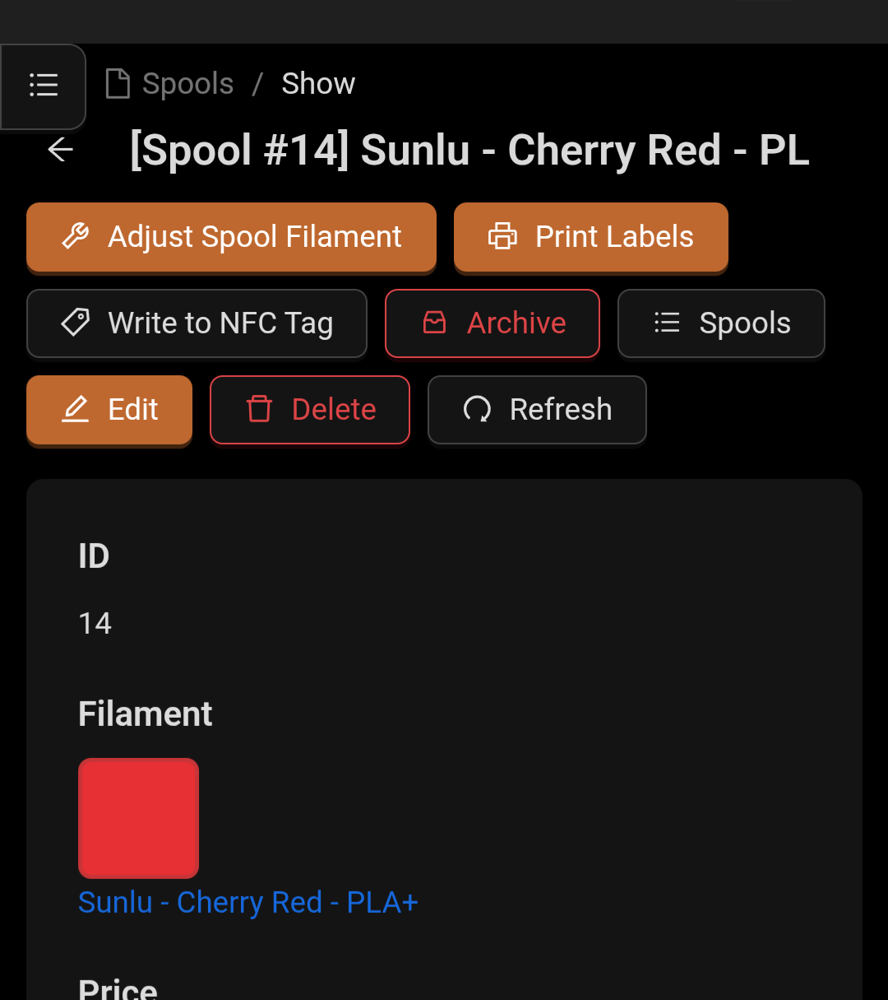

<picture>
  <source media="(prefers-color-scheme: dark)" srcset="https://github.com/Donkie/Spoolman/assets/2332094/4e6e80ac-c7be-4ad2-9a33-dedc1b5ba30e">
  <source media="(prefers-color-scheme: light)" srcset="https://github.com/Donkie/Spoolman/assets/2332094/3c120b3a-1422-42f6-a16b-8d5a07c33000">
  
</picture>

<br/>

# 🏷️ NFC Feature Fork

> **This fork adds NFC/RFID tag support with OpenSpool format integration for physical spool identification and tracking.**

_Keep track of your inventory of 3D-printer filament spools._

Spoolman is a self-hosted web service designed to help you efficiently manage your 3D printer filament spools and monitor their usage. It acts as a centralized database that seamlessly integrates with popular 3D printing software like [OctoPrint](https://octoprint.org/) and [Klipper](https://www.klipper3d.org/)/[Moonraker](https://moonraker.readthedocs.io/en/latest/). When connected, it automatically updates spool weights as printing progresses, giving you real-time insights into filament usage.

[](https://github.com/Donkie/Spoolman/wiki)
[](https://github.com/Donkie/Spoolman/releases)

### Features
* **🏷️ NFC Tag Support**: Write OpenSpool-format NFC tags directly from the web interface using the Web NFC API (Chrome on Android) or NFC Tools app. Tags include spool information and work with OpenSpool readers and Snapmaker U1.
* **🔌 Klipper Multi-Tool Integration**: Automatic spool assignment for multi-tool printers when NFC tags are scanned. Includes macros for Snapmaker U1 and other Klipper systems.
* **Filament Management**: Keep comprehensive records of filament types, manufacturers, and individual spools.
* **API Integration**: The [REST API](https://donkie.github.io/Spoolman/) allows easy integration with other software, facilitating automated workflows and data exchange.
* **Real-Time Updates**: Stay informed with live spool updates through Websockets, providing immediate feedback during printing operations.
* **Central Filament Database**: A community-supported database of manufacturers and filaments simplify adding new spools to your inventory. Contribute by heading to [SpoolmanDB](https://github.com/Donkie/SpoolmanDB).
* **Web-Based Client**: Spoolman includes a built-in web client that lets you manage data effortlessly:
  * View, create, edit, and delete filament data.
  * Add custom fields to tailor information to your specific needs.
  * Print labels with QR codes for easy spool identification and tracking.
  * Contribute to its translation into 18 languages via [Weblate](https://hosted.weblate.org/projects/spoolman/).
* **Database Support**: SQLite, PostgreSQL, MySQL, and CockroachDB.
* **Multi-Printer Management**: Handles spool updates from several printers simultaneously.
* **Advanced Monitoring**: Integrate with [Prometheus](https://prometheus.io/) for detailed historical analysis of filament usage, helping you track and optimize your printing processes. See the [Wiki](https://github.com/Donkie/Spoolman/wiki/Filament-Usage-History) for instructions on how to set it up.

**Spoolman integrates with:**
  * [Moonraker](https://moonraker.readthedocs.io/en/latest/configuration/#spoolman) and most front-ends (Fluidd, KlipperScreen, Mainsail, ...)
  * [OctoPrint](https://github.com/mdziekon/octoprint-spoolman)
  * [OctoEverywhere](https://octoeverywhere.com/spoolman?source=github_spoolman)
  * [Homeassistant](https://github.com/Disane87/spoolman-homeassistant)

**Web client preview:**


## 🏷️ NFC Tag Features

This fork adds comprehensive NFC tag support for physical spool tracking and identification.

### What's New
- **OpenSpool Format**: Write NFC tags in the official [OpenSpool format](OPENSPOOL_FORMAT.md), compatible with OpenSpool readers and Snapmaker U1
- **Web NFC Writer**: Write tags directly from your phone's browser (Chrome on Android with HTTPS)
- **NFC Tag ID Field**: Store and track NFC tag UIDs in the `nfc_id` extra field
- **Klipper Integration**: Automatic spool assignment for multi-tool printers when tags are scanned

**NFC Writer Interface:**

<p align="center">
  
  
</p>

### Usage
1. **Write Tags**: 
   - Navigate to any spool's detail page
   - Click "Write to NFC Tag"
   - Hold your NFC tag near your device
   - Tag is written with OpenSpool JSON including spool_id, material, temperatures, and color

2. **Klipper Integration** (Snapmaker U1 / Multi-Tool):
   - Copy `klipper/spoolman_nfc_integration.cfg` to your Klipper config
   - Include it: `[include spoolman_nfc_integration.cfg]`
   - Scan tags to automatically assign spools to tools
   - See [NFC_FEATURE.md](NFC_FEATURE.md) for full documentation

### OpenSpool Format
Tags written by Spoolman include:
```json
{
  "protocol": "openspool",
  "version": "1.0",
  "spool_id": 3,
  "type": "PETG",
  "color_hex": "FF0000",
  "brand": "Sunlu",
  "min_temp": "220",
  "max_temp": "250",
  "bed_min_temp": "70",
  "bed_max_temp": "85"
}
```

### Requirements
- **For Web NFC**: Chrome on Android, HTTPS connection
- **For Klipper**: Compatible NFC reader (Snapmaker U1 built-in or ESP32 + PN532)
- **Fallback**: Manual writing via NFC Tools app (instructions provided in UI)

See [NFC_FEATURE.md](NFC_FEATURE.md) and [OPENSPOOL_FORMAT.md](OPENSPOOL_FORMAT.md) for complete documentation.

---

## 📱 Mobile Optimizations

The web client has been fully optimized for mobile devices with a comprehensive mobile-first approach, delivering a seamless experience across all screen sizes.

### Mobile Features

**Responsive Layout**
- Fully responsive design that automatically adapts to phones, tablets, and desktops
- Mobile breakpoints at 576px, 768px, and higher for optimal viewing on all devices
- Optimized touch targets (44px minimum) for easy mobile interaction

**Infinite Scroll**
- Efficient data loading on all list pages (spools, filaments, vendors)
- Automatically loads more items as you scroll, eliminating pagination clicks
- Reduced padding and margins (down to 4px) to maximize content visibility on narrow screens

**Dynamic Layout Adjustments**
- Responsive table columns that show/hide based on screen size
- Compact ID columns (50px) to save horizontal space
- Hidden footer on mobile for more usable screen real estate
- Smart form layouts that adapt labelCol and wrapperCol based on viewport

**Touch & Input Optimization**
- Larger, touch-friendly buttons and controls
- 36-40px header buttons with clear icons and text labels
- Reduced modal/card padding to fit more content vertically
- Mobile-optimized date picker with time selector hidden and proper theming

**Performance & Usability**
- QR code scanner moved to header menu dropdown (no floating button)
- Simplified header with space-efficient button layout
- "Write to NFC Tag" action available in spools list dropdown
- Auto-hiding show/archive button on mobile to reduce clutter
- Light/dark theme support with automatic color adaptation

### Technical Implementation

Mobile optimizations are implemented through:
- Centralized `client/src/utils/mobile.css` with 500+ responsive utility rules
- Mobile-friendly theme tokens in App.tsx configuration
- Responsive column definitions across all data tables
- Infinite scroll state management using React hooks
- CSS media queries using Ant Design breakpoint standards

All mobile features are built with the existing technology stack (React, TypeScript, Ant Design, Vite) and require no additional dependencies.

---

## Installation
Please see the [Installation page on the Wiki](https://github.com/Donkie/Spoolman/wiki/Installation) for details how to install Spoolman.
